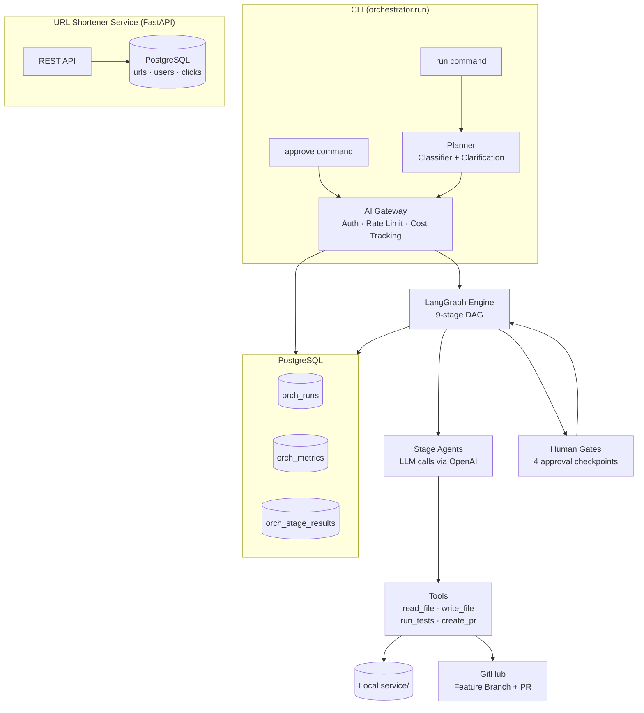
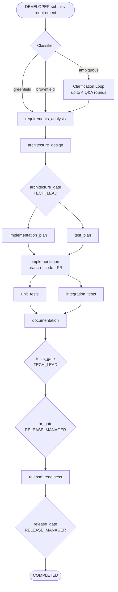

# url-copilot

An AI-powered URL shortener service with an agentic SDLC orchestration system.

**url-copilot** is two things in one:

1. **A production-quality URL shortener** — shorten links, track clicks, view analytics
2. **An AI SDLC orchestrator** — takes any natural-language feature request, plans it, implements it on a feature branch, runs tests, writes documentation, opens a GitHub PR, and requires human approval at four checkpoints before anything ships

---

## What It Does

### URL Shortener Service
- Shorten any long URL to a compact short link
- Optional custom aliases and expiry dates
- Click analytics — by date, country, device, and referrer
- API key authentication with rate limiting per key

### AI Orchestration System (The Copilot)
- Accepts natural-language requirements — feature requests, bug fixes, enhancements
- Classifies intent as `greenfield` (new feature), `brownfield` (modify existing), or `ambiguous` (needs clarification)
- For ambiguous requirements: runs an interactive clarification loop before coding begins
- Executes a 9-stage pipeline: requirements analysis → architecture design → implementation → testing → documentation → release readiness
- Human approval gates at 4 checkpoints — no code is written before Gate 1, nothing ships without Gate 4
- Full audit trail: every LLM call, token cost, stage result, and gate decision recorded in PostgreSQL

---

## System Architecture



---

## Pipeline Flow



---

## Project Structure

```
url-copilot/
├── docs/                        # Documentation
│   ├── QUICK_START.md           # Prerequisites, roles, CLI commands
│   ├── GATES.md                 # Gate reference, RBAC, four-eyes rule
│   ├── ROADMAP.md               # Planned improvements
│   ├── design.md                # FR, NFR, data model, API contracts, HLD
│   ├── orchestrator-architecture.md  # Orchestrator deep-dive
│   ├── TESTING.md               # Test strategy and commands
│   └── scenarios/
│       ├── greenfield.md        # Add a new feature end-to-end
│       ├── brownfield.md        # Modify an existing feature
│       └── ambiguous.md         # Resolve a vague requirement, then implement
├── service/                     # URL shortener (FastAPI)
│   ├── api/v1/endpoints/        # Route handlers
│   ├── models/                  # SQLAlchemy models
│   ├── schemas/                 # Pydantic request/response schemas
│   ├── services/                # Business logic
│   ├── core/                    # Security, rate limiting, URL generation
│   ├── cache/                   # Redis client
│   ├── db/                      # Session + Alembic migrations
│   └── tests/                   # Unit and integration tests (41 tests)
├── orchestrator/                # AI SDLC orchestration system
│   ├── run.py                   # CLI entry point
│   ├── agents/                  # Stage agent (LLM task executor)
│   ├── core/                    # LangGraph engine, state
│   ├── gateway/                 # Auth, rate limit, cost tracking, guardrails
│   ├── governance/              # RBAC checkpoints, audit log
│   ├── planner/                 # Classifier, clarification loop, planner
│   ├── scenarios/               # Greenfield, brownfield, ambiguous DAGs
│   ├── tools/                   # File I/O, GitHub client, test runner
│   ├── metrics/                 # Per-stage metrics tracker
│   ├── state/                   # Run state store (PostgreSQL)
│   ├── prompts/stages/          # Stage prompt .txt files (versioned)
│   ├── config/                  # rbac.yaml, users.yaml
│   └── tests/                   # Orchestrator unit + integration tests
├── docker-compose.yml
├── requirements.txt
└── .env.example
```

---

## Tech Stack

| Layer | Technology |
|---|---|
| API Framework | FastAPI (Python 3.11) |
| Database | PostgreSQL 16 |
| Cache / Rate Limiting | Redis 7 |
| AI / LLM | OpenAI GPT-4o |
| Orchestration Graph | LangGraph |
| Testing | pytest |
| GitHub Integration | PyGithub |
| Containerization | Docker + Docker Compose |

---

## Getting Started

See **[docs/QUICK_START.md](docs/QUICK_START.md)** for the full setup guide.

### Fast path

```bash
git clone git@github.com:agentic-dev-projects/url-copilot.git
cd url-copilot
python3 -m venv .venv && source .venv/bin/activate
pip install -r requirements.txt
cp .env.example .env          # add OPENAI_API_KEY, GITHUB_TOKEN, GITHUB_REPO
docker compose up db cache -d
alembic upgrade head
uvicorn service.main:app --reload
```

The service is now running at `http://localhost:8000`. Open `http://localhost:8000/docs` for the Swagger UI.

---

## Running the Orchestrator

```bash
# Submit a new feature request (greenfield example)
python -m orchestrator.run run "Add QR code endpoint GET /api/v1/urls/{id}/qr" --token alice_dev_token

# Approve the architecture gate (TECH_LEAD)
python -m orchestrator.run approve --run-id orch-<id> --token bob_tl_token

# Check status at any point (any role)
python -m orchestrator.run status --run-id orch-<id> --token alice_dev_token
```

**Three scenarios:**
| Scenario | When to use | Doc |
|---|---|---|
| Greenfield | Adding a completely new feature | [scenarios/greenfield.md](docs/scenarios/greenfield.md) |
| Brownfield | Modifying an existing feature | [scenarios/brownfield.md](docs/scenarios/brownfield.md) |
| Ambiguous | Vague or open-ended requirement | [scenarios/ambiguous.md](docs/scenarios/ambiguous.md) |

**Gate reference:** [docs/GATES.md](docs/GATES.md) — what each gate reviews, who approves it, RBAC table, four-eyes rule.

---

## Running Tests

| Tier | Command | Time |
|---|---|---|
| Service tests (41) | `python -m pytest service/tests/ -q` | < 5s |
| Orchestrator unit tests | `python -m pytest orchestrator/tests/ --ignore=orchestrator/tests/test_e2e_live.py -q` | < 30s |
| Live E2E (real LLM calls, ~$0.01–$0.40) | `RUN_E2E=1 python -m pytest orchestrator/tests/test_e2e_live.py -v -s` | 3–8 min |

See [docs/TESTING.md](docs/TESTING.md) for the full testing guide.

---

## Documentation

| Doc | What it covers |
|---|---|
| [ENGINEERING_SUMMARY.md](docs/ENGINEERING_SUMMARY.md) | Plan/rationale, artifacts, risks/trade-offs, assumptions, limitations |
| [QUICK_START.md](docs/QUICK_START.md) | Prerequisites, roles, all CLI commands |
| [GATES.md](docs/GATES.md) | Gate details, RBAC, four-eyes rule |
| [ROADMAP.md](docs/ROADMAP.md) | Planned improvements and future features |
| [design.md](docs/design.md) | Functional requirements, data model, API contracts, HLD |
| [orchestrator-architecture.md](docs/orchestrator-architecture.md) | Orchestrator component deep-dive |
| [TESTING.md](docs/TESTING.md) | Test strategy, commands, what is mocked vs real |
| [scenarios/greenfield.md](docs/scenarios/greenfield.md) | Step-by-step: add a new feature |
| [scenarios/brownfield.md](docs/scenarios/brownfield.md) | Step-by-step: modify an existing feature |
| [scenarios/ambiguous.md](docs/scenarios/ambiguous.md) | Step-by-step: resolve a vague requirement |
