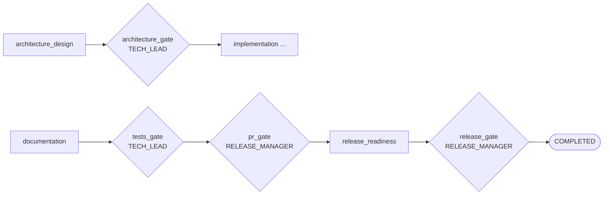

# Gates Reference

Gates are human checkpoints in the orchestrator pipeline. When a gate fires, the pipeline pauses and waits for an authorised user to review the work produced so far and decide whether to approve or reject before execution continues.

For approval commands see [Quick Start — CLI Commands](QUICK_START.md#cli-commands).

---

## The Four Gates



| Gate | Fires after | Required permission | Approver role | What is reviewed |
|---|---|---|---|---|
| `architecture_gate` | `architecture_design` | `approve_architecture` | TECH_LEAD | Requirements scope, affected files, endpoint design, schema change flag |
| `tests_gate` | `documentation` | `approve_architecture` | TECH_LEAD | Unit/integration test results, coverage gaps, new test files |
| `pr_gate` | `tests_gate` approval | `approve_release` | RELEASE_MANAGER | PR URL, branch name, files written, test results, documentation changes |
| `release_gate` | `release_readiness` | `approve_release` | RELEASE_MANAGER | Full release checklist — tests, auth, secrets, docs, error handling |

---

## Gate Details

### architecture_gate

**Purpose:** Ensures a senior engineer validates the technical approach **before any code is written**. Rejecting here costs nothing; approving a bad design costs everything downstream.

**What the approver sees:**
- `requirements_analysis` artifact — scope, affected files, open questions, schema change flag
- `architecture_design` artifact — new/modified files, endpoint design, service changes, risks, assumptions

**When to reject:** Unexpected scope creep, proposed design ignores existing patterns, schema change flag is incorrect, or risks are unacceptable.

---

### tests_gate

**Purpose:** Verifies the feature is adequately tested before it goes to code review. The approver checks that new behaviour is covered and existing tests still pass.

**What the approver sees:**
- `unit_tests` artifact — test count, pass/fail, coverage gaps, files written
- `integration_tests` artifact — test count, pass/fail, endpoints covered, files written

**When to reject:** `passed: 0 / failed: 0` (tests never ran), unacceptable coverage gaps, or existing regression tests failed.

> `tests_gate` requires `approve_architecture` permission — TECH_LEAD or above.

---

### pr_gate

**Purpose:** Code review checkpoint. Confirms the PR was created, implementation matches the approved design, and the branch contains the expected changes.

**What the approver sees:**
- `implementation` artifact — PR URL, PR number, branch name, files written/modified, test results
- `documentation` artifact — files updated, routes documented

**When to reject:** PR URL is `None` (commit/push failed), files written do not match architecture, or test failures were not disclosed.

---

### release_gate

**Purpose:** Final human sign-off before the run is marked complete. Nothing ships without an explicit approval here.

**What the approver sees:**
- `release_readiness` artifact — full checklist, blockers, warnings, READY TO SHIP verdict

**Release checklist:**

| Check | What it verifies |
|---|---|
| `tests_pass` | No failing tests in the suite |
| `auth_enforced` | New/modified endpoints require authentication |
| `no_debug_code` | No `print`, `pdb`, or hardcoded debug flags |
| `endpoints_documented` | All new/modified routes have docstrings |
| `matches_architecture` | Implementation matches the approved architecture design |
| `migration_reversible` | Any DB migration can be rolled back (N/A if no migration) |
| `no_hardcoded_secrets` | No API keys or passwords in source files |
| `soft_delete_followed` | Deletions use `is_active = False`, not hard deletes |
| `dependencies_declared` | New libraries added to `requirements.txt` |
| `error_handling_present` | New endpoints return proper 4xx/5xx responses |

**When to reject:** Unresolved blockers affecting security, data integrity, or correctness.

---

## RBAC — Who Can Approve What

```
ADMIN
  └── inherits RELEASE_MANAGER
        └── inherits TECH_LEAD
              └── inherits DEVELOPER
```

| Permission | DEVELOPER | TECH_LEAD | RELEASE_MANAGER | ADMIN |
|---|---|---|---|---|
| `trigger_run` | ✓ | ✓ | ✓ | ✓ |
| `view_runs` | ✓ | ✓ | ✓ | ✓ |
| `provide_clarification` | ✓ | ✓ | ✓ | ✓ |
| `approve_architecture` | — | ✓ | ✓ | ✓ |
| `approve_schema_change` | — | ✓ | ✓ | ✓ |
| `force_stop` | — | ✓ | ✓ | ✓ |
| `rollback` | — | ✓ | ✓ | ✓ |
| `approve_release` | — | — | ✓ | ✓ |
| `manage_users` | — | — | — | ✓ |
| `emergency_override` | — | — | — | ✓ |

Daily token budgets: DEVELOPER 5 M · TECH_LEAD 200 K · RELEASE_MANAGER 200 K · ADMIN unlimited.

---

## Four-Eyes Rule

The user who submits a run cannot approve any gate on their own run. Every approval must come from a **different** user with the required role.

This is enforced automatically — the `approve` command checks `approver != run.triggered_by` and rejects with an error if they match.

**In practice with the demo tokens:**
- `alice_dev_token` (DEVELOPER) submits → cannot approve any gate
- `bob_tl_token` (TECH_LEAD) approves `architecture_gate` and `tests_gate`
- `carol_rm_token` (RELEASE_MANAGER) approves `pr_gate` and `release_gate`

---

## Approval Commands

```bash
# See all runs awaiting your approval
python -m orchestrator.run review --token <your_token>

# Approve or reject a specific gate
python -m orchestrator.run approve --run-id orch-<id> --token <your_token>
```

The `approve` command displays the relevant artifacts, prompts for an optional review comment, then asks `Approve? [y/n]`.

- **Approve (`y`)** — pipeline resumes from the next stage
- **Reject (`n`)** — run is stopped; submitter sees the outcome via `status`
