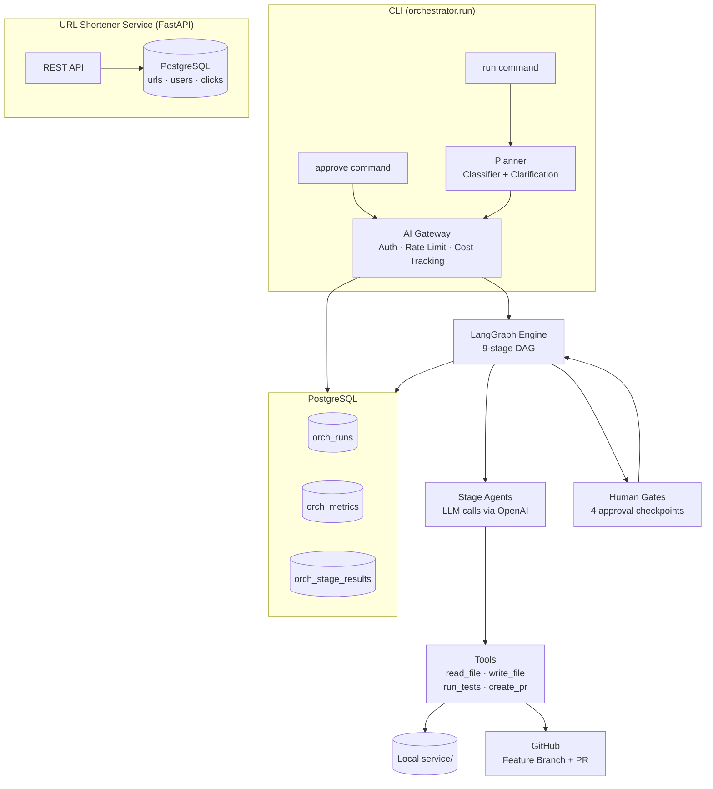

# Orchestrator Architecture — url-copilot

This document is the design reference for the orchestration system. The service layer (`service/`) and orchestrator (`orchestrator/`) are both fully implemented and tested.

---

## System Architecture



---

## Table of Contents

1. [System Overview](#1-system-overview)
2. [Service Layer — Complete](#2-service-layer--complete)
3. [Orchestrator Layer — Complete](#3-orchestrator-layer--complete)
4. [Complete Data Flow](#4-complete-data-flow)
5. [Component Reference](#5-component-reference)
   - 5.1–5.11 (existing components)
   - [5.12 Evaluator (Hybrid LLM-as-Judge)](#512-evaluator-orchestratorevaluator)
6. [Database Schema](#6-database-schema)
7. [RBAC and Authorization](#7-rbac-and-authorization)
8. [Authentication](#8-authentication)
9. [AI Gateway](#9-ai-gateway)
10. [DAG and Orchestration Engine](#10-dag-and-orchestration-engine)
11. [Memory System](#11-memory-system)
12. [Cache Strategy](#12-cache-strategy)
13. [Tool Registry](#13-tool-registry)
14. [Prompt Builder](#14-prompt-builder)
15. [GitHub Integration](#15-github-integration)
16. [Observability](#16-observability)
17. [Configuration Files Reference](#17-configuration-files-reference)
18. [Directory Structure](#18-directory-structure)
19. [Three Scenarios Summary](#19-three-scenarios-summary)
20. [Key Design Decisions and Tradeoffs](#20-key-design-decisions-and-tradeoffs)

---

## 1. System Overview

**url-copilot** is two systems in one repository:

| System | Status | Location |
|---|---|---|
| URL Shortener Service | **Fully implemented** | `service/` |
| AI SDLC Orchestrator | **Fully implemented** | `orchestrator/` |

The **AI SDLC Orchestrator** accepts a natural-language engineering requirement, classifies it, decomposes it into a LangGraph pipeline, executes each stage using OpenAI `gpt-4o` as the doer agent, enforces human approval gates with RBAC, writes actual code changes to `service/`, creates a GitHub PR, and produces a full audit trail.

**Core toolstack**:
- **LangGraph** — pipeline execution engine (parallel stages, interrupt() for human gates, state checkpointing)
- **LangSmith** — automatic LLM observability (traces, token counts, cost, latency — zero instrumentation)
- **OpenAI gpt-4o** — doer agent for all SDLC stages
- **OpenAI o1-mini** — validator agent in the hybrid evaluator

**Assignment context**: This is a Schwab interview project demonstrating agentic SDLC orchestration. The orchestrator is the critical differentiator — evaluated on effectiveness of agentic orchestration, depth of decomposition, validation rigor, and engineering judgment.

**GitHub repository**: `git@github.com:agentic-dev-projects/url-copilot.git`

---

## 2. Service Layer — Complete

### Service Layer (`service/`) — 100% Complete

```
service/
├── api/v1/endpoints/    auth.py, urls.py, analytics.py, redirect.py
├── models/              user.py, api_key.py, short_url.py, click_event.py
├── schemas/             auth.py, url.py, analytics.py
├── services/            auth_service.py, url_service.py, analytics_service.py
├── core/                security.py, url_generator.py, rate_limiter.py
├── cache/               redis_client.py
├── db/
│   ├── session.py       engine, SessionLocal, get_db()
│   ├── base.py          DeclarativeBase
│   └── migrations/      env.py, script.py.mako
│       └── versions/    20260803_1327_0f952025db76_initial_schema.py
├── config.py            Pydantic Settings
└── main.py              FastAPI app, CORS, routers, health check
```

**Tests**: 41 passing (unit: security, url_generator, url_service; integration: auth, urls).

**Alembic**: Migration `0f952025db76` covers all 4 tables (users, api_keys, short_urls, click_events). Run `alembic upgrade head` to apply.

**Running the service**:
```bash
docker compose up db cache -d
alembic upgrade head
uvicorn service.main:app --reload
```

### Infrastructure
- `Dockerfile`, `docker-compose.yml` (PostgreSQL 16, Redis 7, app)
- `.env` / `.env.example`
- `requirements.txt`

---

## 3. Orchestrator Layer — Complete

Everything under `orchestrator/` is implemented. See `docs/_archive/IMPLEMENTATION_PLAN.md` for the build log and phase-by-phase notes.

```
orchestrator/
├── gateway/          AI Gateway (auth, validation, guardrails, LangSmith-traced LLM calls)
├── planner/          Requirement classifier + scenario selector + clarification loop
├── memory/           Cross-run memory (facts, preferences, decisions)
├── cache/            Response cache + tool result cache
├── tools/            Tool registry (read_file, write_file, run_tests, github)
├── prompt_builder/   Assembles final prompt from 7 layers
├── core/             LangGraph state (OrchestratorState), stage models
├── agents/           Thin OpenAI caller wrapped with LangSmith @traceable
├── evaluator/        Hybrid LLM-as-Judge (ValidatorAgent, HybridGate, EvaluationReport)
├── governance/       RBAC checkpoints + SDLC audit log
├── state/            PostgreSQL persistence for all orch_ tables
├── metrics/          Cost budgeting aggregation, MTTR, per-stage summary
├── scenarios/        3 scenario DAG definitions (greenfield, brownfield, ambiguous)
├── config/           users.yaml, rbac.yaml, models.yaml, evaluator.yaml
├── prompts/          Versioned system prompts per stage (stages/ + evaluator/)
└── run.py            CLI entry point (run, approve, status, review commands)
```

---

## 4. Complete Data Flow

```
Developer CLI
  python -m orchestrator.run "<requirement>" --token <user_token>
          │
          ▼
┌─────────────────────────────────────────────────────────────────┐
│                         AI GATEWAY                              │
│  1.  Auth          token → users.yaml → CurrentUser             │
│  2.  AuthZ         RBAC permission check: trigger_run           │
│  3.  Token Budget  daily tokens used vs role limit              │
│  4.  Rate Limit    calls per minute per user                    │
│  5.  Input Valid.  schema check + prompt injection detection    │
│  6.  Input Guard.  PII scan + banned operations check           │
│  7.  Tracer        generate trace_id, start span                │
│  8.  Logger        structured JSON pre-call log entry           │
└──────────────────────────────┬──────────────────────────────────┘
                               │
                               ▼
┌─────────────────────────────────────────────────────────────────┐
│                           PLANNER                               │
│  Classify: greenfield | brownfield | ambiguous                  │
│  Select DAG variant for requirement type                        │
│  Create run record in orch_runs table                           │
│  If ambiguous → enter clarification loop (see Section 19)       │
└──────────────────────────────┬──────────────────────────────────┘
                               │
                               ▼
┌─────────────────────────────────────────────────────────────────┐
│                    ORCHESTRATION ENGINE                         │
│                                                                 │
│  Loop: find ready stages (entry gates satisfied)                │
│        run parallel-ready stages concurrently                   │
│        wait at sync points                                      │
│                                                                 │
│  Per stage:                                                     │
│  ┌───────────────────────────────────────────────────────────┐  │
│  │  PROMPT BUILDER                                           │  │
│  │  1. Stage system prompt  (prompts/{stage}_v{n}.txt)       │  │
│  │  2. Codebase context     (tool: read relevant files)      │  │
│  │  3. Long-term memory     (SELECT from orch_memory)        │  │
│  │  4. Cross-stage context  (RunContext shared state)        │  │
│  │  5. Conversation history (prior turns in this stage)      │  │
│  │  6. Tool results         (accumulated in this stage)      │  │
│  │  7. Stage instruction    (stage-specific directive)       │  │
│  └───────────────────────────────────────────────────────────┘  │
│                             │                                   │
│  CACHE CHECK: hash(prompt) → hit? return cached response        │
│                             │ miss                              │
│  ┌───────────────────────────────────────────────────────────┐  │
│  │  AI GATEWAY (LLM call)                                    │  │
│  │  Model: per models.yaml (gpt-4o or gpt-4o-mini)           │  │
│  │  Static prompt prefix → OpenAI prompt cache               │  │
│  │  Call OpenAI API with function calling (structured output) │  │
│  │  Post-call: output guardrails, schema validation           │  │
│  │  Record: tokens, cost, latency to orch_metrics            │  │
│  └───────────────────────────────────────────────────────────┘  │
│                             │                                   │
│  TOOL REGISTRY: agent calls tools (read_file, write_file, etc.) │
│  TOOL CACHE: cache tool results within run                      │
│                                                                 │
│  EXIT GATE: guardrail scan + output quality check               │
│  RETRY: on failure, max 3 attempts, then human fallback         │
│                                                                 │
│  On evaluation stages (architecture, implementation,            │
│  tests, release_readiness):                                     │
│  EVALUATOR: ValidatorAgent calls o1-mini with critic prompt     │
│  HYBRID GATE: AI evaluation displayed → human comment + [y/n]  │
│  MEMORY WRITER: save human comment to orch_memory              │
│  RUNCONTEXT: save HybridFeedback to stage_evaluations          │
│  AUDIT: append EVALUATOR_COMPLETED / CHECKPOINT_APPROVED[_OVERRIDE] │
│                                                                 │
│  On other approval stages:                                      │
│  RBAC CHECKPOINT: verify role, four-eyes, CLI [y/n]             │
│  MEMORY WRITER: save approval comment to orch_memory            │
│                                                                 │
│  STATE: persist stage result to orch_stage_results              │
│  AUDIT: append event to orch_audit_events                       │
│  RUNCONTEXT: update shared cross-stage state                    │
└─────────────────────────────────────────────────────────────────┘
                               │
                               ▼
                  Feature branch created on GitHub
                  Code written to service/ files
                  PR created (auto-generated body)
                  TECH_LEAD reviews + merges on GitHub
                  Orchestrator polls for merge
                               │
                               ▼
                  RELEASE_MANAGER approves via CLI gate
                               │
                               ▼
                  Run complete → User feedback prompt [1-4]
                  Feedback saved to orch_runs table
```

---

## 5. Component Reference

### 5.1 AI Gateway (`orchestrator/gateway/`)

Central choke point for all LLM calls and CLI entry. Every request passes through before any LLM call is made.

**Files**:

| File | Responsibility |
|---|---|
| `gateway.py` | `AIGateway` class — orchestrates all components in order |
| `auth.py` | `TokenAuthenticator` — resolves token to `CurrentUser` via users.yaml |
| `input_validator.py` | `InputValidator` — schema + prompt injection pattern detection |
| `guardrails.py` | `GuardrailChecker` — pre/post call PII scan, banned ops, code safety |
| `rate_limiter.py` | `RateLimiter` — per-user calls/minute (in-memory dict) |
| `token_budget.py` | `TokenBudgetManager` — daily token cap per role (PostgreSQL) |
| `tracer.py` | `RequestTracer` — trace_id UUID, span start/end timing |
| `logger.py` | `StructuredLogger` — JSON log lines to stdout |
| `cost_tracker.py` | `CostTracker` — tokens × price → USD, writes to orch_metrics |

**Key class: `AIGateway`**:
```python
class AIGateway:
    def call(self, request: GatewayRequest) -> GatewayResponse:
        # Pre-call pipeline (raises exception to block request)
        user = self.auth.resolve(request.token)
        self.rbac.check(user, Permission.TRIGGER_RUN)
        self.token_budget.check(user, estimated_tokens=request.prompt_length // 4)
        self.rate_limiter.check(user)
        self.input_validator.validate(request.prompt)
        self.guardrails.check_input(request.prompt)
        trace_id = self.tracer.start(request)
        self.logger.log_request(trace_id, user, request)

        # LLM call
        response = self.openai_client.call(
            model=request.model,
            messages=request.messages,
            tools=request.tools
        )

        # Post-call pipeline
        self.guardrails.check_output(response.content)
        self.cost_tracker.record(trace_id, user, response.usage)
        self.logger.log_response(trace_id, response)
        self.tracer.end(trace_id)
        return GatewayResponse(content=response.content, usage=response.usage, trace_id=trace_id)
```

**Prompt injection patterns detected** (in `input_validator.py`):
- "ignore previous instructions"
- "ignore your system prompt"
- "you are now"
- "disregard all prior"
- "forget everything above"

**Output guardrail code safety patterns** (in `guardrails.py`):
- `os.system(`, `subprocess.`, `eval(`, `exec(`
- `rm -rf`, `DROP TABLE`, `DELETE FROM` (without WHERE)
- hardcoded secrets: `password =`, `secret =`, `api_key =` with string values
- file paths outside project root

### 5.2 Planner (`orchestrator/planner/`)

| File | Responsibility |
|---|---|
| `classifier.py` | Single gpt-4o-mini call: classifies requirement to greenfield/brownfield/ambiguous |
| `planner.py` | Selects scenario DAG, creates run record, enters clarification loop if ambiguous |

**Classification prompt** (in `prompts/classifier_v1.txt`): Instructs model to return JSON `{"type": "greenfield"|"brownfield"|"ambiguous", "reasoning": "..."}`.

**Ambiguous handling**: If classified as ambiguous, `planner.py` runs the clarification loop (max 2 rounds of questions) before building the execution plan. Assumptions are saved to `orch_memory`. Resolved requirements are stored in `RunContext.resolved_requirement`.

### 5.3 Core (`orchestrator/core/`)

| File | Responsibility |
|---|---|
| `stage.py` | `StageStatus` enum, `StageNode` dataclass, `StageResult` dataclass |
| `state.py` | `OrchestratorState` TypedDict — LangGraph shared state passed between every node |
| `engine.py` | `OrchestrationEngine` — builds the LangGraph `StateGraph`, registers nodes/edges, compiles with `PostgresSaver`, invokes the graph |

**Why TypedDict instead of dataclass?**
LangGraph requires state to be a `TypedDict` (or Pydantic model). Each node returns a *partial* dict — only the keys it changed — and LangGraph merges the update into the full state automatically. This is more efficient than passing and copying a full dataclass on every node transition.

**OrchestratorState key fields**:
```python
class OrchestratorState(TypedDict, total=False):
    run_id:                 str
    requirement:            str
    resolved_requirement:   str
    scenario_type:          str           # greenfield | brownfield | ambiguous
    triggered_by:           str           # github_login — used for four-eyes check
    stage_artifacts:        dict[str, Any]  # stage_name → output artifact
    stage_evaluations:      dict[str, Any]  # stage_name → HybridFeedback (as dict)
    feature_branch:         str | None
    pr_url:                 str | None
    pr_number:              int | None
    schema_change_detected: bool
    assumptions:            list[str]
    tool_cache:             dict[str, Any]  # in-memory only, not checkpointed
```

**LangGraph checkpointing**: `PostgresSaver` serialises the full `OrchestratorState` to PostgreSQL after every node. If the process crashes or a human gate pauses the run, resuming is: `graph.invoke(None, config)` with the same `thread_id`.

**RunContext fields**:
```python
@dataclass
class RunContext:
    run_id: str
    requirement: str
    resolved_requirement: str         # set after clarification loop
    scenario_type: str                # greenfield | brownfield | ambiguous
    triggered_by: str                 # github_login of triggering user
    stage_artifacts: dict[str, Any]   # keyed by stage_name
    tool_cache: dict[str, Any]        # within-run tool result cache
    feature_branch: str | None        # set after create_branch tool call
    pr_url: str | None                # set after create_pr tool call
    schema_change_detected: bool      # triggers Gate #2 if True
    stage_evaluations: dict[str, HybridFeedback]  # keyed by stage_name; injected into Layer 4 of Prompt Builder for all downstream stages
```

### 5.4 Agents (`orchestrator/agents/`)

| File | Responsibility |
|---|---|
| `stage_agent.py` | Thin per-stage LLM caller. Builds GatewayRequest, calls AIGateway, parses structured output |

`stage_agent.py` does NOT handle auth, logging, guardrails, or retries — all delegated to the gateway. Its only job: construct the right prompt via PromptBuilder and parse the JSON output into a typed artifact.

### 5.5 Governance (`orchestrator/governance/`)

| File | Responsibility |
|---|---|
| `checkpoint.py` | `RBACCheckpoint` — validates role, four-eyes, CLI [y/n] approval |
| `audit.py` | `AuditLogger` — append-only JSONL to orch_audit_events (never UPDATE, only INSERT) |

**Checkpoint flow**:
```
checkpoint.request_approval(run_id, gate_name, required_permission, triggered_by)
  → look up current CLI user from --token flag
  → check user.role has required_permission
  → check user.github_login != triggered_by  (four-eyes)
  → display gate summary to CLI
  → prompt [y/n] + optional comment
  → if approved: write to orch_audit_events, save comment to orch_memory
  → if rejected: mark stage FAILED, halt run
```

**SDLC audit event types**:
`STAGE_STARTED`, `STAGE_COMPLETED`, `STAGE_FAILED`, `STAGE_RETRYING`,
`CHECKPOINT_REACHED`, `CHECKPOINT_APPROVED`, `CHECKPOINT_REJECTED`, `CHECKPOINT_APPROVED_OVERRIDE`,
`EVALUATOR_STARTED`, `EVALUATOR_COMPLETED`,
`RUN_STARTED`, `RUN_COMPLETED`, `RUN_FAILED`, `PR_CREATED`, `PR_MERGED`,
`MEMORY_WRITTEN`, `CLARIFICATION_ASKED`, `CLARIFICATION_ANSWERED`

`CHECKPOINT_APPROVED_OVERRIDE` is logged when a human approves despite the AI validator reporting `blocking_issues`. The `details` JSONB column stores both the AI evaluation and the human's override justification for the compliance audit trail.

### 5.6 State Store (`orchestrator/state/`)

| File | Responsibility |
|---|---|
| `store.py` | `RunStateStore` — all reads/writes to orch_ PostgreSQL tables |

Uses the same `service.db.session.SessionLocal` as the service layer. No second DB connection.

**Tables managed by RunStateStore**:
`orch_runs`, `orch_stage_results`, `orch_audit_events`, `orch_metrics`, `orch_memory`, `orch_cache`

**User identity** is NOT stored in a DB table — it is resolved from `config/users.yaml` by `TokenAuthenticator` and passed around as a `CurrentUser` dataclass.

### 5.7 Metrics Tracker (`orchestrator/metrics/`)

| File | Responsibility |
|---|---|
| `tracker.py` | `MetricsTracker` — aggregates orch_metrics, computes MTTR, success rate, cost per run |

Metrics are written incrementally after each stage (by `cost_tracker.py`). `MetricsTracker.summarize(run_id)` aggregates at run end for the final report.

### 5.8 Memory (`orchestrator/memory/`)

| File | Responsibility |
|---|---|
| `store.py` | `MemoryStore` — read/write orch_memory table |
| `seeds.yaml` | 5 hardcoded codebase facts loaded on first run |

**Memory types**: `fact`, `preference`, `decision`, `convention`

**Auto-capture**: After every human approval with a comment, `checkpoint.py` calls `MemoryStore.save(type="preference", actor=user, content=comment)`.

**Prompt injection**: `MemoryStore.load_relevant()` returns all active memories as a formatted string block injected into layer 3 of the Prompt Builder.

**Seeds** (loaded once at `orchestrator/memory/seeds.yaml`):
```yaml
facts:
  - "Framework: FastAPI with SQLAlchemy ORM and Pydantic v2 schemas"
  - "Database: PostgreSQL 16 with Alembic migrations, prefix orch_ for orchestrator tables"
  - "Auth: API key via X-API-Key header, SHA-256 hashed, never store plaintext"
  - "Soft deletes via is_active flag — never hard delete URL or user records"
  - "Test suite uses SQLite in-memory — no external services needed to run tests"
```

### 5.9 Cache (`orchestrator/cache/`)

| File | Responsibility |
|---|---|
| `response_cache.py` | `ResponseCache` — hash(prompt) → cached response, stored in orch_cache table |
| `tool_cache.py` | `ToolCache` — in-memory dict, scoped to current run, keyed on (tool_name, args_hash) |

**Response cache TTL**: 24 hours. Same prompt + model → same response (deterministic at temperature=0).

**Tool cache**: `read_file` results are cached within a run. If the agent reads `service/api/v1/router.py` twice in the same stage, second call returns cached content — no filesystem hit.

### 5.10 Tool Registry (`orchestrator/tools/`)

| File | Tools |
|---|---|
| `registry.py` | `ToolRegistry` — maps name → function, wraps all calls with tool latency tracking |
| `filesystem.py` | `read_file(path)`, `write_file(path, content)`, `search_codebase(query)` |
| `test_runner.py` | `run_tests(path?)`, `run_linter()` |
| `github_client.py` | `create_branch(name)`, `create_pr(title, body, branch)`, `poll_pr_status(pr_number)` |

**Safety constraint on `write_file`**: path must be under `service/` directory. Any attempt to write outside raises `GuardrailError`.

**GitHub client uses**: `GITHUB_TOKEN` (service account PAT) from `.env`. User identity for PR attribution comes from `RunContext.triggered_by`.

**Tool latency**: Every tool call is wrapped in a timer; latency written to `orch_metrics.tool_latency_ms`.

### 5.11 Prompt Builder (`orchestrator/prompt_builder/`)

| File | Responsibility |
|---|---|
| `builder.py` | `PromptBuilder` — assembles 7-layer prompt |
| `loader.py` | `PromptLoader` — reads versioned prompt files from `orchestrator/prompts/` |

**7-layer assembly order** (static layers first for OpenAI prompt caching):
```
Layer 1: Stage system prompt       (STATIC — cache prefix candidate)
Layer 2: Codebase context          (STATIC per run — cache prefix candidate)
Layer 3: Long-term memory          (loaded from orch_memory)
Layer 4: Cross-stage context       (from RunContext.stage_artifacts + stage_evaluations)
Layer 5: Conversation history      (prior turns in current stage)
Layer 6: Tool results              (accumulated tool call results)
Layer 7: Current stage instruction (dynamic — not cached)
```

Layers 1+2 are identical across many calls in a run → good OpenAI prompt cache candidates.

Layer 4 includes both prior stage artifacts AND any `HybridFeedback` from `RunContext.stage_evaluations`. This means implementation stages see the architecture reviewer's concerns; test stages see the implementation reviewer's notes. Doer agents can proactively address reviewer feedback without being re-instructed.

**Prompt version** is recorded as `{stage_name}_v{n}` (e.g., `architecture_v1`) in `orch_stage_results.prompt_version`.

---

## 6. Database Schema

All orchestrator tables are prefixed `orch_` and co-located in the same PostgreSQL instance as the URL shortener service. A new Alembic migration (`orch_tables`) must be created and applied.

```sql
-- Table relationships:
-- orch_runs → orch_stage_results (1:many)
-- orch_runs → orch_audit_events  (1:many)
-- orch_runs → orch_metrics       (1:many, one per LLM/tool call)
-- orch_runs → orch_memory        (1:many, nullable — seeds have no run)
-- orch_cache standalone (response cache)

-- Note: no orch_users table.
-- User identity is resolved at auth time by TokenAuthenticator reading
-- config/users.yaml directly.  Every component that needs user info
-- receives a CurrentUser dataclass — never queries a DB table.
-- actor in orch_audit_events stores github_login as a plain string.

CREATE TABLE orch_runs (
    id                UUID PRIMARY KEY DEFAULT gen_random_uuid(),
    requirement       TEXT NOT NULL,
    resolved_req      TEXT,                    -- set after clarification loop
    scenario_type     VARCHAR(20) NOT NULL,    -- greenfield|brownfield|ambiguous
    status            VARCHAR(20) NOT NULL DEFAULT 'running',
    triggered_by      VARCHAR(100) NOT NULL,   -- github_login
    created_at        TIMESTAMPTZ NOT NULL DEFAULT now(),
    completed_at      TIMESTAMPTZ,
    feature_branch    VARCHAR(200),
    pr_url            VARCHAR(500),
    feedback_score    SMALLINT,                -- 1-4, set at run end
    feedback_comment  TEXT
);

CREATE TABLE orch_stage_results (
    id               UUID PRIMARY KEY DEFAULT gen_random_uuid(),
    run_id           UUID NOT NULL REFERENCES orch_runs(id),
    stage_name       VARCHAR(50) NOT NULL,
    status           VARCHAR(20) NOT NULL,
    attempt_number   SMALLINT NOT NULL DEFAULT 1,
    prompt_version   VARCHAR(30),              -- e.g. "architecture_v1"
    model_used       VARCHAR(50),              -- e.g. "gpt-4o"
    started_at       TIMESTAMPTZ NOT NULL DEFAULT now(),
    completed_at     TIMESTAMPTZ,
    input_context    JSONB,                    -- snapshot of RunContext at stage start
    output_artifact  JSONB,                    -- structured output from LLM
    error_message    TEXT
);
CREATE INDEX idx_stage_results_run ON orch_stage_results(run_id);

CREATE TABLE orch_audit_events (
    id           UUID PRIMARY KEY DEFAULT gen_random_uuid(),
    run_id       UUID NOT NULL REFERENCES orch_runs(id),
    event_type   VARCHAR(50) NOT NULL,
    stage_name   VARCHAR(50),
    actor        VARCHAR(100) NOT NULL,        -- github_login or "system"
    actor_role   VARCHAR(30),
    details      JSONB,
    created_at   TIMESTAMPTZ NOT NULL DEFAULT now()
    -- NO UPDATE ever. Append-only.
);
CREATE INDEX idx_audit_run ON orch_audit_events(run_id);
CREATE INDEX idx_audit_type ON orch_audit_events(event_type);

CREATE TABLE orch_metrics (
    id               UUID PRIMARY KEY DEFAULT gen_random_uuid(),
    run_id           UUID NOT NULL REFERENCES orch_runs(id),
    stage_name       VARCHAR(50) NOT NULL,
    trace_id         VARCHAR(100),
    tokens_in        INTEGER,
    tokens_out       INTEGER,
    cost_usd         DECIMAL(10, 6),
    llm_latency_ms   INTEGER,
    tool_latency_ms  INTEGER,
    cache_hit        BOOLEAN DEFAULT FALSE,
    model_used       VARCHAR(50),
    prompt_version   VARCHAR(30),
    attempt_count    SMALLINT,
    created_at       TIMESTAMPTZ NOT NULL DEFAULT now()
);
CREATE INDEX idx_metrics_run ON orch_metrics(run_id);

CREATE TABLE orch_memory (
    id             UUID PRIMARY KEY DEFAULT gen_random_uuid(),
    source_run_id  UUID REFERENCES orch_runs(id),    -- NULL for seeded facts
    memory_type    VARCHAR(30) NOT NULL,              -- fact|preference|decision|convention
    actor          VARCHAR(100) NOT NULL,             -- github_login or "seed"
    content        TEXT NOT NULL,
    is_active      BOOLEAN NOT NULL DEFAULT TRUE,
    created_at     TIMESTAMPTZ NOT NULL DEFAULT now()
);

CREATE TABLE orch_cache (
    id            UUID PRIMARY KEY DEFAULT gen_random_uuid(),
    prompt_hash   VARCHAR(64) NOT NULL UNIQUE,        -- SHA-256 of full prompt
    model_used    VARCHAR(50) NOT NULL,
    response      JSONB NOT NULL,
    hit_count     INTEGER NOT NULL DEFAULT 0,
    created_at    TIMESTAMPTZ NOT NULL DEFAULT now(),
    expires_at    TIMESTAMPTZ NOT NULL               -- created_at + 24h
);
CREATE INDEX idx_cache_hash ON orch_cache(prompt_hash);
CREATE INDEX idx_cache_expires ON orch_cache(expires_at);
```

**Alembic migration**: Create `service/db/migrations/versions/{date}_orch_tables.py` with the above DDL in `upgrade()` and corresponding `DROP TABLE` in `downgrade()`.

---

## 7. RBAC and Authorization

### Role Hierarchy

```
ADMIN
  └── RELEASE_MANAGER
        └── TECH_LEAD
              └── DEVELOPER
```

Each role inherits all permissions of the role below it.

### Permission Matrix

| Permission | DEVELOPER | TECH_LEAD | RELEASE_MGR | ADMIN |
|---|:---:|:---:|:---:|:---:|
| `trigger_run` | ✓ | ✓ | ✓ | ✓ |
| `view_runs` | ✓ | ✓ | ✓ | ✓ |
| `provide_clarification` | ✓ | ✓ | ✓ | ✓ |
| `approve_architecture` | ✗ | ✓ | ✓ | ✓ |
| `approve_schema_change` | ✗ | ✓ | ✓ | ✓ |
| `approve_release` | ✗ | ✗ | ✓ | ✓ |
| `force_stop` | ✗ | ✓ | ✓ | ✓ |
| `rollback` | ✗ | ✓ | ✓ | ✓ |
| `manage_users` | ✗ | ✗ | ✗ | ✓ |

### Four-Eyes Policy

The person who **triggers** a run (`orch_runs.triggered_by`) cannot approve **any gate** on that same run, regardless of their role. Checked in `checkpoint.py` at every approval:

```python
if approver.github_login == run.triggered_by:
    raise FourEyesViolationError(
        f"{approver.github_login} cannot approve a run they triggered"
    )
```

### Daily Token Budget per Role

Defined in `orchestrator/config/rbac.yaml`:
```
DEVELOPER:       50,000 tokens/day
TECH_LEAD:      200,000 tokens/day
RELEASE_MANAGER: 200,000 tokens/day
ADMIN:          unlimited
```

Tracked in `orch_metrics` — `TokenBudgetManager.check(user)` sums today's `tokens_in + tokens_out` for the user across all runs.

---

## 8. Authentication

### Prototype Approach: Token-Based with YAML Registry

Every CLI command requires `--token <value>`. The token is resolved to a `CurrentUser` by `IdentityResolver`:

```python
@dataclass
class CurrentUser:
    github_login: str
    email: str
    role: str
    permissions: list[str]
```

Resolution: read `orchestrator/config/users.yaml`, look up token key → return user fields.

### Mock Users (in `orchestrator/config/users.yaml`)

```yaml
users:
  alice_dev_token:
    github_login: alice
    email: alice@example.com
    role: DEVELOPER

  bob_tl_token:
    github_login: bob
    email: bob@example.com
    role: TECH_LEAD

  carol_rm_token:
    github_login: carol
    email: carol@example.com
    role: RELEASE_MANAGER

  dave_admin_token:
    github_login: dave
    email: dave@example.com
    role: ADMIN
```

### Production Replacement

Replace `IdentityResolver.resolve(token)` implementation:
- Call `GET https://api.github.com/user` with `Authorization: Bearer {token}`
- Get `login` from response
- Look up role in `orch_users` PostgreSQL table
- Everything else (RBAC, four-eyes, audit) unchanged

### Secret Management

```
~/.orchestrator/config.yaml  (per-user, chmod 600, never in repo)
  → User PAT for GitHub identity (production only)

.env  (project root, gitignored)
  DATABASE_URL=postgresql://...
  OPENAI_API_KEY=sk-...
  GITHUB_TOKEN=ghp_...    ← service account PAT for branch/PR creation
  GITHUB_REPO=agentic-dev-projects/url-copilot
```

---

## 9. AI Gateway

See Component Reference 5.1 for implementation detail. Summary of the 11-layer pipeline:

**Pre-call** (blocks request if any check fails):
1. Auth — token → CurrentUser
2. AuthZ — RBAC permission check
3. Token Budget — daily cap by role
4. Rate Limit — calls/minute
5. Input Validation — schema + injection detection
6. Input Guardrails — PII scan, banned ops
7. Tracer — trace_id start
8. Logger — pre-call JSON entry

**LLM Call**:
- OpenAI API with function calling (structured output)
- Static prompt prefix marked for OpenAI prompt caching

**Post-call**:
9. Output Guardrails — PII in response, dangerous code scan, hallucination check
10. Output Validation — response matches expected JSON schema
11. Cost Tracker — tokens × model price → orch_metrics
12. Logger — post-call JSON entry
13. Tracer — span end

### Two Log Streams

**Gateway log** (technical telemetry per LLM call):
```json
{"trace_id": "tr-abc", "event": "llm_response", "tokens_in": 842,
 "tokens_out": 1204, "latency_ms": 1823, "model": "gpt-4o",
 "cache_hit": false, "cost_usd": 0.0031}
```

**SDLC audit log** (business events, stored in `orch_audit_events`):
```json
{"run_id": "orch-green-001", "event": "CHECKPOINT_APPROVED",
 "stage": "ARCHITECTURE_DESIGN", "actor": "bob", "role": "TECH_LEAD",
 "details": {"comment": "Use segno not qrcode library"}}
```

---

## 10. LangGraph Pipeline and Orchestration Engine

### Stage Definitions

```
REQUIREMENTS_ANALYSIS
ARCHITECTURE_DESIGN
IMPLEMENTATION_PLAN       (parallel with TEST_PLAN)
TEST_PLAN                 (parallel with IMPLEMENTATION_PLAN)
IMPLEMENTATION
UNIT_TESTS                (parallel with INTEGRATION_TESTS)
INTEGRATION_TESTS         (parallel with UNIT_TESTS)
DOCUMENTATION
RELEASE_READINESS
```

### LangGraph Pipeline Topology

```
START
  │
requirements_analysis
  │
architecture_design
  │
architecture_gate          ← interrupt() — hybrid eval + human [y/n]
  │
┌─┴─────────────────┐
implementation_plan  test_plan     ← parallel fan-out
└─────────┬──────────┘
          │  fan-in sync (LangGraph waits for both before advancing)
      implementation
          │
  ┌───────┴────────┐  conditional edge on schema_change_detected
  │                │
schema_gate     (skip)            ← Gate #2 conditional
  └───────┬────────┘
          │
  ┌───────┴────────┐
  unit_tests  integration_tests   ← parallel fan-out
  └───────┬────────┘
          │  fan-in sync
      tests_gate                  ← interrupt() — hybrid eval + human [y/n]
          │
      documentation
          │
      pr_gate                     ← interrupt() — wait for GitHub PR merge
          │
      release_readiness
          │
      release_gate                ← interrupt() — hybrid eval + human [y/n]
          │
         END
```

Each node is a plain Python function `(OrchestratorState) -> dict` that returns only the state keys it changed. LangGraph merges the partial update and checkpoints the new state to PostgreSQL via `PostgresSaver` before advancing.

### Human Gates

| Gate | Stage | Required Permission | Condition |
|---|---|---|---|
| #1 Architecture | ARCHITECTURE_DESIGN | `approve_architecture` | Always — includes hybrid AI evaluation |
| #2 Schema Change | IMPLEMENTATION | `approve_schema_change` | Only if `state["schema_change_detected"] == True` |
| #3 Implementation Review | IMPLEMENTATION | `approve_architecture` | Always — includes hybrid AI evaluation |
| #4 Tests Review | Post UNIT+INTEGRATION_TESTS | `approve_architecture` | Always — includes hybrid AI evaluation |
| #5 PR Review | Post-DOCUMENTATION | GitHub PR approval | Always — TECH_LEAD must merge PR on GitHub |
| #6 Release | RELEASE_READINESS | `approve_release` | Always — includes hybrid AI evaluation |

Gate nodes use LangGraph's `interrupt(payload)` to pause the run, serialise state to PostgreSQL, and wait. Resuming: `graph.invoke(None, config)` with the same `thread_id`.

Hybrid evaluation (Section 5.12) runs inside the gate node before `interrupt()` is called — the AI evaluation result is included in the interrupt payload displayed to the human reviewer.

### Retry on Stage Failure

LangGraph's `RetryPolicy` retries a failed node up to `max_attempts` times with configurable backoff. After all attempts fail, the graph transitions to a `FAILED` terminal state and the engine prints a human fallback message.

```python
from langgraph.pregel import RetryPolicy
node_with_retry = stage_node.with_retry(
    RetryPolicy(max_attempts=3)
)
```

---

## 11. Memory System

### Three Memory Sources

1. **Seeds** — loaded from `orchestrator/memory/seeds.yaml` on first run if `orch_memory` table is empty.
2. **Auto-capture** — checkpoint comments are automatically saved after every human approval.
3. **Clarification decisions** — assumptions confirmed during ambiguous requirement resolution.

### Prompt Injection

`MemoryStore.load_relevant()` returns all active memories as a formatted block for Layer 3 of the Prompt Builder:

```
=== Team Conventions and Preferences ===
[fact] Framework: FastAPI with SQLAlchemy ORM and Pydantic v2 schemas
[fact] Test suite uses SQLite in-memory — no external services needed to run tests
[preference] prefer segno over qrcode for QR generation  (bob, 2026-08-03)
[preference] Redis failures must never block the redirect path  (bob, 2026-08-03)
[convention] request_id must propagate to DB query context  (bob, 2026-08-03)
```

### Memory Table Schema

See Section 6 — `orch_memory` table. Key fields: `memory_type`, `actor`, `content`, `is_active`.

---

## 12. Cache Strategy

### Three Caches

**OpenAI Prompt Cache** (zero code required — structural):
- Layers 1+2 of the prompt (system prompt + codebase context) are identical within a run
- These are placed at the start of every message → OpenAI automatically caches the common prefix
- Savings: ~50% token cost reduction on repeated calls within same run

**Response Cache** (`orchestrator/cache/response_cache.py`):
- Key: `SHA-256(prompt_text + model_name)`
- Storage: `orch_cache` PostgreSQL table
- TTL: 24 hours
- Used when: re-running a failed stage with identical inputs (no new context)
- Hit → return cached response, record `cache_hit=True` in orch_metrics

**Tool Result Cache** (`orchestrator/cache/tool_cache.py`):
- In-memory `dict` scoped to current `RunContext`
- Key: `SHA-256(tool_name + json(args))`
- Evicted: when run ends
- Used when: agent calls `read_file` on the same path twice in a stage

---

## 13. Tool Registry

Tools available to the stage agent via OpenAI function calling:

| Tool | Args | Returns | Notes |
|---|---|---|---|
| `read_file` | `path: str` | `content: str` | Path must be under project root |
| `write_file` | `path: str, content: str` | `success: bool` | Path must be under `service/` |
| `search_codebase` | `query: str` | `matches: list[dict]` | grep-based, returns file+line+snippet |
| `run_tests` | `path: str = None` | `result: TestResult` | Runs pytest, returns pass/fail counts |
| `run_linter` | — | `result: LintResult` | Runs flake8/ruff |
| `create_branch` | `name: str` | `branch_url: str` | GitHub API, uses service PAT |
| `create_pr` | `title, body, branch` | `pr_number: int, pr_url: str` | GitHub API |
| `poll_pr_status` | `pr_number: int` | `merged: bool, merged_by: str` | GitHub API |

**All tools** are wrapped by `ToolRegistry` which adds:
- Tool cache lookup before execution
- Tool latency measurement after execution
- Write to `orch_metrics.tool_latency_ms`

---

## 14. Prompt Builder

Versioned system prompts are stored in `orchestrator/prompts/`:

```
requirements_v1.txt
architecture_v1.txt
implementation_plan_v1.txt
test_plan_v1.txt
implementation_v1.txt
unit_tests_v1.txt
integration_tests_v1.txt
documentation_v1.txt
release_readiness_v1.txt
classifier_v1.txt        ← used by Planner
```

Each prompt file contains the system prompt for that stage. The `PromptBuilder` assembles the 7 layers and returns a `list[dict]` (OpenAI messages format).

**Prompt version tracking**: When a prompt file is updated, increment the version suffix (e.g., `architecture_v2.txt`). Update `models.yaml` to point to the new version. The old file is kept for comparison. Version is recorded in `orch_stage_results.prompt_version`.

---

### 5.12 Evaluator (`orchestrator/evaluator/`)

**Purpose**: Hybrid LLM-as-Judge evaluation applied at 4 key stages. A second AI model (`o1-mini`) independently reviews the doer agent's output and surfaces concerns. A human reviewer sees both the AI critique and the stage artifact, adds their own comment, and the combined `HybridFeedback` is injected into all downstream stages via Prompt Builder Layer 4.

**Why o1-mini as validator**: o1-mini is a reasoning model — it is slower and more expensive per call than gpt-4o-mini, but better at systematic critique: finding logical gaps, missing edge cases, incomplete error handling. Using a different model from the doer prevents echo-chamber validation.

#### Stages that receive hybrid evaluation

| Stage | What the validator reviews | Blocking threshold |
|---|---|---|
| `ARCHITECTURE_DESIGN` | Pattern choice, failure modes, security, DB impact | `overall_score < 2` |
| `IMPLEMENTATION` | Code correctness, cache invalidation, error handling, no secrets | `overall_score < 2` |
| `UNIT_TESTS + INTEGRATION_TESTS` | Coverage of happy path + error cases, regression risk | `overall_score < 2` |
| `RELEASE_READINESS` | Checklist completeness, migration safety, dependency CVEs | `overall_score < 2` |

#### Files

| File | Responsibility |
|---|---|
| `validator_agent.py` | Calls `o1-mini` with critic system prompt. Parses structured `EvaluationReport`. |
| `evaluation_report.py` | `EvaluationReport` dataclass + `HybridFeedback` dataclass |
| `hybrid_gate.py` | Displays AI report at CLI, collects human comment, builds `HybridFeedback`, saves to `RunContext.stage_evaluations` and `orch_audit_events`. |

#### Key dataclasses

```python
# orchestrator/evaluator/evaluation_report.py

from dataclasses import dataclass, field
from typing import Literal

@dataclass
class EvaluationReport:
    stage_name: str
    overall_score: int                  # 1–5  (1=reject, 3=pass-with-notes, 5=excellent)
    strengths: list[str]
    concerns: list[str]                 # non-blocking — informational
    blocking_issues: list[str]          # score < 2 means human must acknowledge these
    suggestions: list[str]
    recommendation: Literal["APPROVE", "APPROVE_WITH_NOTES", "REJECT"]

@dataclass
class HybridFeedback:
    stage_name: str
    ai_evaluation: EvaluationReport
    human_comment: str                  # free text from reviewer (may be empty)
    approved_by: str                    # github_login of reviewer
    override: bool = False              # True if approved despite blocking_issues
```

#### `validator_agent.py` — ValidatorAgent

```python
class ValidatorAgent:
    def evaluate(
        self,
        stage_name: str,
        stage_artifact: dict,
        context: RunContext,
        gateway: AIGateway,
    ) -> EvaluationReport:
        # Load stage-specific evaluator prompt from orchestrator/prompts/evaluator/
        # Build messages: [system=critic_prompt, user=stage_artifact JSON]
        # Call gateway with model=o1-mini (from evaluator.yaml)
        # Parse structured JSON response → EvaluationReport
        # Log EVALUATOR_STARTED / EVALUATOR_COMPLETED to orch_audit_events
```

Evaluator prompts live in `orchestrator/prompts/evaluator/`:
```
eval_architecture_v1.txt
eval_implementation_v1.txt
eval_tests_v1.txt
eval_release_v1.txt
```

Each prompt instructs o1-mini to return a JSON object matching the `EvaluationReport` schema.

#### `hybrid_gate.py` — HybridGate

```python
class HybridGate:
    def run(
        self,
        stage_name: str,
        stage_artifact: dict,
        context: RunContext,
        gateway: AIGateway,
        audit: AuditLogger,
        required_permission: str,
        approver_token: str,
    ) -> HybridFeedback:
        # 1. Run ValidatorAgent → EvaluationReport
        # 2. Display AI evaluation to CLI (score, strengths, concerns, blocking_issues)
        # 3. Display stage artifact summary
        # 4. Prompt human reviewer for comment + [y/n] to approve
        # 5. If approved with blocking_issues present → set override=True
        #    → log CHECKPOINT_APPROVED_OVERRIDE to orch_audit_events
        # 6. If approved without blocking_issues → log CHECKPOINT_APPROVED
        # 7. If rejected → log CHECKPOINT_REJECTED, raise ApprovalRejectedError
        # 8. Build HybridFeedback → save to context.stage_evaluations[stage_name]
        # 9. Save human_comment to orch_memory if non-empty
        # 10. Return HybridFeedback
```

#### CLI display at a hybrid gate

```
━━━━━━━━━━━━━━━━━━━━━━━━━━━━━━━━━━━━━━━━━━━━━━━━━━━━
[orch-green-001] AI Evaluation — ARCHITECTURE_DESIGN
Validator model: o1-mini   Score: 4/5   Recommendation: APPROVE_WITH_NOTES
━━━━━━━━━━━━━━━━━━━━━━━━━━━━━━━━━━━━━━━━━━━━━━━━━━━━
Strengths:
  ✓ SVG format avoids heavy PIL dependency — correct choice
  ✓ StreamingResponse pattern consistent with existing codebase
  ✓ Owner-only auth enforced

Concerns (non-blocking):
  • Consider adding a max pixel size parameter to prevent abuse
  • SVG content-type header should include charset=utf-8

Blocking issues: none

━━━━━━━━━━━━━━━━━━━━━━━━━━━━━━━━━━━━━━━━━━━━━━━━━━━━
Human review required (TECH_LEAD)
Approving as: bob (TECH_LEAD)
Comment (Enter to skip):
Approve? [y/n]:
```

If blocking issues are present and human still approves:
```
⚠  AI identified blocking issues. Approving will log CHECKPOINT_APPROVED_OVERRIDE.
Justification for override (required): ...
```

#### Prompt Builder injection (Layer 4)

After a hybrid gate completes, `RunContext.stage_evaluations` holds the `HybridFeedback`. The `PromptBuilder` injects this into Layer 4 for all subsequent stages:

```
=== Prior Stage Evaluations ===
[ARCHITECTURE_DESIGN — score 4/5]
AI concerns: Consider adding max pixel size parameter
Human comment: Good choice on SVG. Use segno library, not qrcode.
```

This gives downstream stages (IMPLEMENTATION, TESTS, etc.) full context about what the reviewer observed, enabling the doer agent to proactively address concerns without being explicitly re-instructed.

#### Config: `orchestrator/config/evaluator.yaml`

```yaml
enabled_stages:
  - architecture_design
  - implementation
  - tests          # covers both unit_tests and integration_tests (run once after both complete)
  - release_readiness

validator_model: o1-mini

prompts:
  architecture_design: evaluator/eval_architecture_v1.txt
  implementation:      evaluator/eval_implementation_v1.txt
  tests:               evaluator/eval_tests_v1.txt
  release_readiness:   evaluator/eval_release_v1.txt
```

---

## 15. GitHub Integration

### Service Account Token

All automated GitHub operations (create branch, push code, open PR) use `GITHUB_TOKEN` from `.env`. This is a machine-user PAT with `repo` scope on the `agentic-dev-projects/url-copilot` repository.

### Branch Naming Convention

```
orch/feature/{slug}-{run_id_short}
e.g. orch/feature/qr-code-orch-green-001
     orch/feature/redis-cache-orch-brown-002
     orch/feature/prod-ready-orch-ambig-003
```

### PR Body Template

Auto-generated in `github_client.create_pr()`:

```markdown
## Summary
{bullet points from implementation_plan artifact}

## Changes
{files created/modified with brief description}

## Tests
{test results: N/N passing, N new tests}

## Orchestration Run
- Run ID: {run_id}
- Triggered by: {triggered_by} ({role})
- Architecture approved by: {approver} ({role}) — {timestamp}
- Prompt version: {prompt_version}
- Model used: {model}

## Assumptions
{list of assumptions from RunContext, if any}
```

### PR Merge Detection

After PR creation, orchestrator polls every 30 seconds:
```python
while True:
    status = github_client.poll_pr_status(pr_number)
    if status.merged:
        context.pr_merged_by = status.merged_by
        audit.log(PR_MERGED, actor=status.merged_by)
        break
    if status.closed_without_merge:
        raise PRRejectedError("PR was closed without merging")
    time.sleep(30)
```

---

## 16. Observability

Observability is split between **LangSmith** (LLM traces) and **our orch_ tables** (business events + cost budgeting).

### LangSmith — LLM Tracing (automatic)

Set three env vars in `.env` — no code instrumentation required:
```
LANGCHAIN_TRACING_V2=true
LANGCHAIN_API_KEY=lsv2_...
LANGCHAIN_PROJECT=url-copilot
```

The OpenAI client is wrapped with `langsmith.wrappers.wrap_openai()` at gateway startup. From that point every call is captured automatically:

| What LangSmith captures | Where visible |
|---|---|
| Full input/output per LLM call | LangSmith dashboard trace tree |
| Token counts (in + out) per call | LangSmith dashboard |
| Cost per call (auto-calculated) | LangSmith dashboard |
| LLM latency per call | LangSmith dashboard |
| Prompt version used | LangSmith metadata |
| Model used | LangSmith metadata |
| Evaluator (o1-mini) calls | LangSmith as child spans |

### orch_ Tables — Business Events and Cost Budgeting

| Metric | Source | Stored in | Field |
|---|---|---|---|
| End-to-end run latency | Engine timer | `orch_runs` | `completed_at - created_at` |
| Tool latency per call | Tool registry | `orch_metrics` | `tool_latency_ms` |
| Tokens + cost per call | Gateway CostTracker | `orch_metrics` | `tokens_in`, `tokens_out`, `cost_usd` |
| Cache hit | Cache layer | `orch_metrics` | `cache_hit` |
| Retry count | LangGraph RetryPolicy | `orch_stage_results` | `attempt_number` |
| Stage failure reason | Exception capture | `orch_stage_results` | `error_message` |
| SDLC decisions | Human gates | `orch_audit_events` | `event_type`, `details` |
| User feedback | CLI end of run | `orch_runs` | `feedback_score`, `feedback_comment` |
| AI evaluation score | Evaluator | `orch_audit_events` | `details.ai_score`, `details.recommendation` |
| Override decisions | HybridGate | `orch_audit_events` | `event_type=CHECKPOINT_APPROVED_OVERRIDE` |

**Why keep `orch_metrics` if LangSmith already tracks tokens?**
`TokenBudgetManager` enforces per-role daily token caps by querying `orch_metrics` in real time before every LLM call. Querying our own PostgreSQL is sub-millisecond — calling the LangSmith API for budget decisions would add latency and a network dependency to every single call.

### Key Derived Metrics (computed by MetricsTracker)

```python
# MTTR: average time from STAGE_FAILED to next STAGE_COMPLETED on retry
mttr = avg(retry_completed_at - failure_at) per run

# Cost per run (also visible in LangSmith, but available locally)
total_cost = sum(cost_usd) from orch_metrics where run_id = ?

# Cache efficiency
cache_hit_rate = sum(cache_hit=True) / count(*) from orch_metrics
```

---

## 17. Configuration Files Reference

### `orchestrator/config/users.yaml` (mock auth token registry)
```yaml
users:
  alice_dev_token:
    github_login: alice
    email: alice@example.com
    role: DEVELOPER
  bob_tl_token:
    github_login: bob
    email: bob@example.com
    role: TECH_LEAD
  carol_rm_token:
    github_login: carol
    email: carol@example.com
    role: RELEASE_MANAGER
  dave_admin_token:
    github_login: dave
    email: dave@example.com
    role: ADMIN
```

### `orchestrator/config/rbac.yaml` (roles, permissions, token budgets)
```yaml
roles:
  DEVELOPER:
    permissions: [trigger_run, view_runs, provide_clarification]
    daily_token_budget: 50000
  TECH_LEAD:
    inherits: DEVELOPER
    permissions: [approve_architecture, approve_schema_change, force_stop, rollback]
    daily_token_budget: 200000
  RELEASE_MANAGER:
    inherits: TECH_LEAD
    permissions: [approve_release]
    daily_token_budget: 200000
  ADMIN:
    inherits: RELEASE_MANAGER
    permissions: [manage_users, emergency_override]
    daily_token_budget: unlimited
```

### `orchestrator/config/models.yaml` (per-stage model selection)
```yaml
stages:
  requirements_analysis:  gpt-4o-mini
  architecture_design:    gpt-4o
  implementation_plan:    gpt-4o-mini
  test_plan:              gpt-4o-mini
  implementation:         gpt-4o
  unit_tests:             gpt-4o
  integration_tests:      gpt-4o
  documentation:          gpt-4o-mini
  release_readiness:      gpt-4o-mini
  classifier:             gpt-4o-mini
```

### `orchestrator/memory/seeds.yaml` (seeded codebase facts)
```yaml
facts:
  - "Framework: FastAPI with SQLAlchemy ORM and Pydantic v2 schemas"
  - "Database: PostgreSQL 16 with Alembic migrations, prefix orch_ for orchestrator tables"
  - "Auth: API key via X-API-Key header, SHA-256 hashed, never store plaintext"
  - "Soft deletes via is_active flag — never hard delete URL or user records"
  - "Test suite uses SQLite in-memory — no external services needed to run tests"
```

### `orchestrator/config/evaluator.yaml` (hybrid AI evaluation settings)
```yaml
enabled_stages:
  - architecture_design
  - implementation
  - tests          # covers both unit_tests + integration_tests combined
  - release_readiness

validator_model: o1-mini

prompts:
  architecture_design: evaluator/eval_architecture_v1.txt
  implementation:      evaluator/eval_implementation_v1.txt
  tests:               evaluator/eval_tests_v1.txt
  release_readiness:   evaluator/eval_release_v1.txt
```

---

## 18. Directory Structure

```
url-copilot/
│
├── service/                          ← URL shortener service (fully implemented)
│   ├── api/v1/endpoints/
│   ├── models/
│   ├── schemas/
│   ├── services/
│   ├── core/
│   ├── cache/
│   ├── db/
│   │   └── migrations/versions/     ← existing migration: 0f952025db76
│   ├── tests/
│   ├── config.py
│   └── main.py
│
├── orchestrator/                     ← AI SDLC orchestrator (fully implemented)
│   ├── __init__.py
│   ├── run.py                        ← CLI entry point
│   │
│   ├── gateway/
│   │   ├── __init__.py
│   │   ├── gateway.py
│   │   ├── auth.py
│   │   ├── input_validator.py
│   │   ├── guardrails.py
│   │   ├── rate_limiter.py
│   │   ├── token_budget.py
│   │   ├── tracer.py
│   │   ├── logger.py
│   │   └── cost_tracker.py
│   │
│   ├── planner/
│   │   ├── __init__.py
│   │   ├── classifier.py
│   │   └── planner.py
│   │
│   ├── core/
│   │   ├── __init__.py
│   │   ├── stage.py
│   │   ├── stage.py
│   │   ├── state.py          ← OrchestratorState TypedDict (LangGraph state)
│   │   └── engine.py         ← builds + invokes the LangGraph StateGraph
│   │
│   ├── agents/
│   │   ├── __init__.py
│   │   └── stage_agent.py
│   │
│   ├── governance/
│   │   ├── __init__.py
│   │   ├── checkpoint.py
│   │   └── audit.py
│   │
│   ├── state/
│   │   ├── __init__.py
│   │   └── store.py
│   │
│   ├── metrics/
│   │   ├── __init__.py
│   │   └── tracker.py
│   │
│   ├── memory/
│   │   ├── __init__.py
│   │   ├── store.py
│   │   └── seeds.yaml
│   │
│   ├── cache/
│   │   ├── __init__.py
│   │   ├── response_cache.py
│   │   └── tool_cache.py
│   │
│   ├── tools/
│   │   ├── __init__.py
│   │   ├── registry.py
│   │   ├── filesystem.py
│   │   ├── test_runner.py
│   │   └── github_client.py
│   │
│   ├── prompt_builder/
│   │   ├── __init__.py
│   │   ├── builder.py
│   │   └── loader.py
│   │
│   ├── evaluator/                    ← NEW — hybrid LLM-as-Judge component
│   │   ├── __init__.py
│   │   ├── validator_agent.py        ← calls o1-mini with critic prompt
│   │   ├── evaluation_report.py      ← EvaluationReport + HybridFeedback dataclasses
│   │   └── hybrid_gate.py            ← combines AI eval + human review into HybridFeedback
│   │
│   ├── scenarios/
│   │   ├── __init__.py
│   │   ├── base.py
│   │   ├── greenfield.py
│   │   ├── brownfield.py
│   │   └── ambiguous.py
│   │
│   ├── config/
│   │   ├── users.yaml
│   │   ├── rbac.yaml
│   │   ├── models.yaml
│   │   └── evaluator.yaml            ← NEW — enabled stages + validator model
│   │
│   └── prompts/
│       ├── classifier_v1.txt
│       ├── requirements_v1.txt
│       ├── architecture_v1.txt
│       ├── implementation_plan_v1.txt
│       ├── test_plan_v1.txt
│       ├── implementation_v1.txt
│       ├── unit_tests_v1.txt
│       ├── integration_tests_v1.txt
│       ├── documentation_v1.txt
│       ├── release_readiness_v1.txt
│       └── evaluator/                ← NEW — critic prompts for o1-mini
│           ├── eval_architecture_v1.txt
│           ├── eval_implementation_v1.txt
│           ├── eval_tests_v1.txt
│           └── eval_release_v1.txt
│
├── docs/
│   ├── design.md                     ← URL shortener service design (complete)
│   ├── orchestrator-architecture.md  ← THIS FILE
│   ├── _archive/IMPLEMENTATION_PLAN.md  ← build log (archived)
│   └── scenarios/
│       ├── greenfield.md
│       ├── brownfield.md
│       └── ambiguous.md
│
├── Dockerfile
├── docker-compose.yml
├── requirements.txt                  ← add openai, PyYAML, pygithub to this
├── alembic.ini
├── .env / .env.example
└── README.md
```

---

## 19. Three Scenarios Summary

Full scenario walkthroughs are in `docs/scenarios/`. Summary:

| | Greenfield | Brownfield | Ambiguous |
|---|---|---|---|
| **Requirement** | "Add QR code endpoint GET /api/v1/urls/{id}/qr" | "Cache frequently accessed URLs in Redis on the redirect hot path" | "Make the service production-ready" |
| **Classification** | Immediate — no ambiguity | Immediate — modifies known hot path | Triggers clarification loop |
| **First agent action** | Build architecture from spec | Read redirect.py and redis_client.py first | Read entire codebase, map gaps against NFRs in design.md |
| **Critical insight** | Format choice (SVG > PNG) | Cache invalidation in url_service.py | SOC2 compliance scoping |
| **Gate #2** | Skipped (no schema change) | Skipped (no schema change) | Skipped (no schema change) |
| **New files** | qr.py, updated router | No new files — modifies existing | logging.py, metrics.py, updated main.py |
| **Test count** | 45 → 51 | 45 → 57 | 45 → 53 |
| **Memory output** | Library preference | Failure handling rule | Compliance context + assumptions |

---

## 20. Key Design Decisions and Tradeoffs

| Decision | Choice | Rationale | Tradeoff |
|---|---|---|---|
| LLM | OpenAI gpt-4o | Supports function calling, system prompts, streaming; best balance of speed and quality | Vendor lock-in; cost per token |
| Cheap stages use gpt-4o-mini | Yes | Requirements classification, test plan, docs — templated tasks | Slight quality reduction vs gpt-4o |
| Validator model | o1-mini | Reasoning model — better at systematic critique than gpt-4o-mini | 3–5x slower than gpt-4o-mini; adds ~20s per evaluated stage |
| Hybrid evaluation | AI evaluation + human review combined | AI catches obvious issues cheaply; human brings judgment on ambiguous findings; combined feedback improves downstream stages | Adds one extra LLM call and one human pause per evaluated stage |
| Compliance override pattern | Human can approve despite AI blocking issues; logged as CHECKPOINT_APPROVED_OVERRIDE | Avoids hard blocks in edge cases; keeps human in ultimate control | Requires human justification text; creates audit trail that compliance can review |
| State backend | PostgreSQL (existing) | Reuses existing infrastructure; queryable metrics; ACID guarantees | Orchestrator requires DB to run |
| Auth | Token + YAML mock | Self-contained prototype; swappable interface to GitHub PAT | Not production-safe; spoofable |
| Human approval | CLI [y/n] | Simple, works everywhere; gate *location* matters more than mechanism | Not asynchronous; approver must be present |
| Code review gate | GitHub PR | Integrates with existing workflow; PR is the real diff review tool | Requires GitHub API token; adds polling |
| Four-eyes | Trigger user ≠ approver | Satisfies SOX/change-control requirements | Increases gate friction |
| Artifact scope | Actual code changes | Demonstrates real autonomous capability | Requires strong output guardrails |
| Parallel stages | Yes (impl_plan + test_plan; unit + integration) | Reduces wall-clock time; independent work streams | Slightly more complex engine logic |
| Dynamic re-planning | Upstream change → invalidate downstream | Correct behavior; avoids stale stage outputs | Not yet implemented; deferred to Phase 2 engine work |
| RAG | Not applicable | Codebase is local; read directly into prompt | Doesn't scale to very large codebases |
| Memory | PostgreSQL orch_memory | Same DB, queryable, persistent across sessions | Simple key-value; no semantic similarity |
| Response cache | PostgreSQL orch_cache | Persistent across restarts; handles reruns of identical prompts | DB round-trip adds ~5ms vs in-memory |
| Tool write safety | Write only under service/ | Prevents agent writing to arbitrary paths | Agent cannot modify orchestrator's own code |
| Pipeline engine | LangGraph StateGraph | Native parallel fan-out, built-in interrupt() for human gates, declarative graph definition ~80 lines vs ~400 lines custom | Adds dependency; graph topology must be declared upfront |
| LLM observability | LangSmith (automatic) | Zero-instrumentation tracing via wrap_openai(); full trace tree, token counts, cost, latency in dashboard | External SaaS; not suitable for real-time budget enforcement |
| State checkpointing | LangGraph PostgresSaver | Reuses existing PostgreSQL; run survives crash or gate pause; resume with same thread_id | Serialises full OrchestratorState on every node transition |
| State representation | OrchestratorState TypedDict | Required by LangGraph; each node returns partial dict — only changed keys; LangGraph merges automatically | Less IDE auto-complete than dataclass; no default values |
