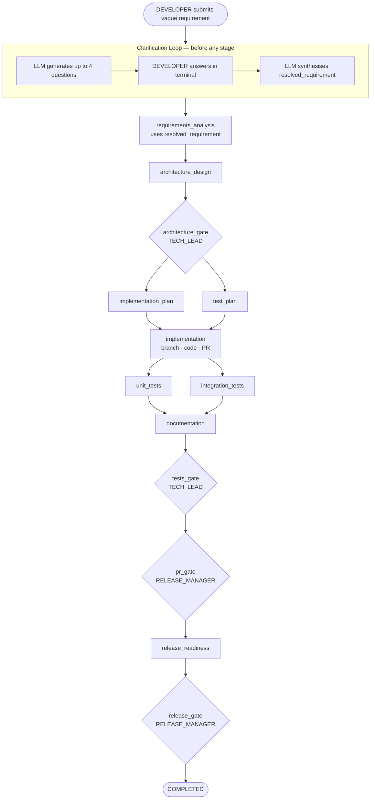

# Scenario 3 — Ambiguous

An ambiguous run handles requirements that are too vague, contradictory, or under-specified
to classify as greenfield or brownfield. Before the pipeline starts, the orchestrator runs
a **clarification loop** — the LLM asks up to 4 targeted questions in the terminal, the
DEVELOPER answers them, and the orchestrator synthesises a single unambiguous resolved
requirement. The full 9-stage pipeline then runs on that resolved requirement.

The key difference from greenfield and brownfield: **clarification happens before Stage 1**,
and the pipeline runs with `resolved_requirement` (the scoped version) rather than the
original vague input.

---

## Prerequisites and Roles

See [Quick Start](../QUICK_START.md) for prerequisites, role tokens, and all CLI commands.

---

## Pipeline Overview



Total: **clarification loop + 9 stages + 4 gates**.

---

## Approval Gates

See [Gates Reference](../GATES.md) for full details on all four gates, the RBAC permission matrix, and the four-eyes rule.

| Gate | Approver role |
|---|---|
| `architecture_gate` | TECH_LEAD |
| `tests_gate` | TECH_LEAD |
| `pr_gate` | RELEASE_MANAGER |
| `release_gate` | RELEASE_MANAGER |

---

## What Makes a Requirement "Ambiguous"

The classifier routes to ambiguous when the requirement:
- Is too vague to determine scope ("improve the URL shortener")
- Uses undefined terms that could mean very different things ("add team support", "add smart redirects")
- Mixes greenfield and brownfield concerns in the same request
- Is missing critical details needed to choose an implementation approach

**Example requirements that trigger ambiguous:**
```bash
"Make the URL shortener more enterprise-friendly"
"Add team workspace features"
"Add notifications for URL activity"
```

---

## Step-by-Step

### Step 1 — DEVELOPER submits the requirement

```bash
python -m orchestrator.run run "Make the URL shortener more enterprise-friendly" --token alice_dev_token
```

**What it does:**
- Authenticates the token and verifies the DEVELOPER role has `trigger_run` permission
- Classifier detects the requirement is too vague to route — returns `ambiguous`
- **Clarification loop fires immediately** — before any pipeline stage runs
- The LLM generates up to 4 targeted questions about scope and intent
- Each question appears in the terminal; the DEVELOPER types an answer
- After all answers, the LLM synthesises a single `resolved_requirement`
- A run record is created and the full 9-stage pipeline starts on the resolved requirement
- Pauses at `architecture_gate`

**Expected output:**
```
Clarification needed:
  What specific aspect of "enterprise-friendly" are you targeting — security
  and compliance (audit logs, SSO), operational concerns (monitoring, SLAs),
  team collaboration (shared URLs, RBAC), or something else?
Your answer: team collaboration — shared URL lists and role-based access

Clarification needed:
  Should team members share a single API key, or should each member have
  their own key with access scoped to their team's URLs?
Your answer: each member has their own key, scoped to the team

Clarification needed:
  Should existing URLs created before teams existed be migrated to a default
  team, or remain as personal URLs?
Your answer: remain as personal, no migration needed

Run ID:   orch-<8-char-hex>
Scenario: ambiguous

Starting pipeline for run orch-<id>...

Pipeline paused — waiting for gate approval.

  Run ID : orch-<id>
  Gate   : architecture_gate  (requires: approve_architecture)

Next steps:
  # Approver — see all pending reviews:
  python -m orchestrator.run review --token <approver_token>

  # Approver — approve this specific run:
  python -m orchestrator.run approve --run-id orch-<id> --token <approver_token>

  # Check current status and per-stage metrics:
  python -m orchestrator.run status --run-id orch-<id> --token <your_token>
```

> **Run ID appears after answering all questions** — the clarification loop runs before the run record is created.

> **Save the Run ID** — you will pass it to every subsequent `approve` command.

> **Next approver: TECH_LEAD** — use `bob_tl_token`

---

### Step 2 — TECH_LEAD approves the architecture gate

```bash
python -m orchestrator.run approve --run-id orch-<id> --token bob_tl_token
```

**What it does:**
- Displays the `requirements_analysis` and `architecture_design` artifacts
- The `requirements_analysis` artifact shows **both the original vague requirement and the resolved requirement** — the TECH_LEAD can verify the scope is correct before any code is written
- The assumptions list from the clarification loop is also shown

**Expected output:**
```
Authenticated as: bob
Run ID     : orch-<id>
Gate       : architecture_gate
Submitted by: alice

Requirement: Make the URL shortener more enterprise-friendly

============================================================

  ────────────────────────────────────────────────────────
  REQUIREMENTS ANALYSIS
  ────────────────────────────────────────────────────────

  ORIGINAL REQUIREMENT:
  Make the URL shortener more enterprise-friendly

  RESOLVED REQUIREMENT:
  Add team-based URL sharing — a Team model with members, each with their
  own API key scoped to the team's URLs. Existing personal URLs are not
  migrated. No SSO or audit log changes in this scope.

  ASSUMPTIONS:
    • Each team member has their own API key scoped to the team
    • Existing personal URLs remain personal (no migration)
    • Team feature is new (greenfield path within ambiguous scenario)

  AFFECTED FILES:
    • service/models/ (new Team, TeamMember models)
    • service/api/v1/endpoints/ (new teams endpoints)
    • service/db/migrations/ (schema migration required)

  SCHEMA CHANGE LIKELY: YES ⚠

  ────────────────────────────────────────────────────────
  ARCHITECTURE DESIGN
  ────────────────────────────────────────────────────────

  NEW ENDPOINTS:
    POST /api/v1/teams          — create a team
    GET  /api/v1/teams/{id}     — get team + members
    POST /api/v1/teams/{id}/members — add a member

  SCHEMA CHANGE REQUIRED: Yes — Team and TeamMember tables
  ...
============================================================

Review comment (optional, press Enter to skip): lgtm — scope is right
Approve? [y/n]: y

Approved by bob. Resuming pipeline...
```

**What runs after approval:**
- `implementation_plan` and `test_plan` run in parallel
- `implementation` runs — creates feature branch, writes code, runs tests, commits, opens PR
- `unit_tests` and `integration_tests` run in parallel
- `documentation` runs
- Pipeline pauses at `tests_gate`

```
Pipeline paused at next gate: tests_gate
  Required permission: approve_architecture

To continue:
  python -m orchestrator.run review --token <approver_token>
  python -m orchestrator.run approve --run-id orch-<id> --token <approver_token>

To see the current status:
  python -m orchestrator.run status --run-id orch-<id> --token <your_token>
```

> **Next approver: TECH_LEAD** — use `bob_tl_token`

---

### Step 3 — TECH_LEAD approves the tests gate

```bash
python -m orchestrator.run approve --run-id orch-<id> --token bob_tl_token
```

**What it does:**
- Displays `unit_tests` and `integration_tests` artifacts
- Prompts for approval

**Expected output:**
```
Authenticated as: bob
Gate       : tests_gate

  ────────────────────────────────────────────────────────
  UNIT TESTS
  ────────────────────────────────────────────────────────

  TEST RESULTS:
    failed: 0
    passed: 41
    success: True

  TEST FILES WRITTEN:
    • service/tests/unit/test_team_service.py

  ────────────────────────────────────────────────────────
  INTEGRATION TESTS
  ────────────────────────────────────────────────────────

  TEST RESULTS:
    failed: 0
    passed: 3
    success: True

  TEST FILES WRITTEN:
    • service/tests/integration/test_teams.py
============================================================

Review comment (optional, press Enter to skip): lgtm
Approve? [y/n]: y

Approved by bob. Resuming pipeline...

Pipeline paused at next gate: pr_gate
```

> No stages run between `tests_gate` and `pr_gate` — the pipeline immediately pauses again.

> **Next approver: RELEASE_MANAGER** — use `carol_rm_token`

---

### Step 4 — RELEASE_MANAGER approves the PR gate

```bash
python -m orchestrator.run approve --run-id orch-<id> --token carol_rm_token
```

**What it does:**
- Displays `implementation` and `documentation` artifacts
- Carol can see the PR URL and verify the branch contains the expected changes

**Expected output:**
```
Authenticated as: carol
Gate       : pr_gate

  ────────────────────────────────────────────────────────
  IMPLEMENTATION
  ────────────────────────────────────────────────────────

  PR URL:
  https://github.com/agentic-dev-projects/url-copilot/pull/<N>

  BRANCH NAME:
  feature/enterprise-teams-<run-id>

  TEST RESULTS:
    failed: 0
    passed: 41
    success: True

  FILES WRITTEN:
    • service/models/team.py
    • service/api/v1/endpoints/teams.py
    • service/db/migrations/versions/20260804_1200_<rev>_add_teams.py

  ────────────────────────────────────────────────────────
  DOCUMENTATION
  ────────────────────────────────────────────────────────

  ROUTES DOCUMENTED:
    • POST /api/v1/teams
    • GET  /api/v1/teams/{id}
    • POST /api/v1/teams/{id}/members
============================================================

Review comment (optional, press Enter to skip): lgtm
Approve? [y/n]: y

Approved by carol. Resuming pipeline...
```

**What runs after approval:**
- `release_readiness` runs
- Pipeline pauses at `release_gate`

> **Next approver: RELEASE_MANAGER** — use `carol_rm_token`

---

### Step 5 — RELEASE_MANAGER approves the release gate

```bash
python -m orchestrator.run approve --run-id orch-<id> --token carol_rm_token
```

**Expected output:**
```
Authenticated as: carol
Gate       : release_gate

  ────────────────────────────────────────────────────────
  RELEASE READINESS
  ────────────────────────────────────────────────────────

  BLOCKERS: (none)

  CHECKLIST:
    tests_pass: True
    auth_enforced: True
    no_debug_code: True
    endpoints_documented: True
    matches_architecture: True
    migration_reversible: True
    no_hardcoded_secrets: True
    soft_delete_followed: True
    dependencies_declared: True
    error_handling_present: True

  READY TO SHIP: Yes
============================================================

Review comment (optional, press Enter to skip): lgtm
Approve? [y/n]: y

Approved by carol. Resuming pipeline...

============================================================
  RUN SUMMARY — orch-<id>
============================================================
  Requirement : Make the URL shortener more enterprise-friendly
  Scenario    : ambiguous
  Cost (USD)  : ~$0.45
  Tokens      : ~155,000
  Stages done : 9
  Stages fail : 0
  Retries     : 0
============================================================

How satisfied are you with this run's output?
  1 = Unusable   2 = Needs work   3 = Good   4 = Excellent
Score [1-4] (or press Enter to skip):
```

> **No further approvals needed** — the run is complete.

---

### Step 6 — (Optional) Check status at any point

```bash
python -m orchestrator.run status --run-id orch-<id> --token <any_token>
```

**Who can run it:** Any authenticated token regardless of role.

Shows: current gate, stage completion table, and per-stage token/cost/latency breakdown. The `resolved_requirement` (not the original vague text) is shown as the requirement.

---

### Step 7 — (Optional) Review without approving

```bash
python -m orchestrator.run review --token bob_tl_token
```

Lists all runs currently awaiting approval visible to this token's role.

---

## Stage Reference

All 9 stages are identical to the greenfield pipeline — see [Greenfield — Stage Reference](greenfield.md#stage-reference) for full descriptions. The only difference in ambiguous runs is:

- **Classifier** runs before Stage 1 and returns `ambiguous`
- **ClarificationLoop** fires before Stage 1: generates up to 4 questions, collects answers via terminal `input()`, synthesises `resolved_requirement` and `assumptions`
- **requirements_analysis (Stage 1)** reads `resolved_requirement` from state instead of the original `requirement`
- All subsequent stages behave identically to greenfield or brownfield depending on what the clarification resolved to

---

## What to Verify After the Run

| Check | Where to look |
|---|---|
| Clarification was captured | `requirements_analysis` artifact at architecture_gate — shows resolved_requirement and assumptions |
| Feature branch created | GitHub → branches list |
| PR opened | GitHub → Pull Requests |
| Resolved requirement used | PR body — should reference the scoped requirement, not the vague original |
| All 9 stages completed | Run summary — `Stages done: 9`, `Stages fail: 0` |

---

## Troubleshooting

**Requirement routed to greenfield or brownfield instead of ambiguous**
— The classifier did not find the requirement vague enough. Make it more open-ended or use undefined terms. Examples that reliably trigger ambiguous: `"Make the URL shortener more enterprise-friendly"`, `"Improve URL management"`, `"Add team workspace features"`.

**Clarification questions don't appear — pipeline starts immediately**
— The classifier returned greenfield or brownfield with high confidence. Check the `Scenario:` line printed after submission.

**`ERROR: DATABASE_URL is not set`**
— PostgreSQL is not running or `.env` is missing. Run `docker-compose up -d db` and check `.env`.

**`Daily token budget exceeded`**
— The clarification loop uses additional LLM calls before the pipeline starts, increasing total token usage. Raise `DEVELOPER.daily_token_budget` in `orchestrator/config/rbac.yaml` if needed.
